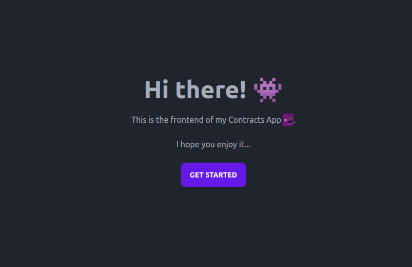
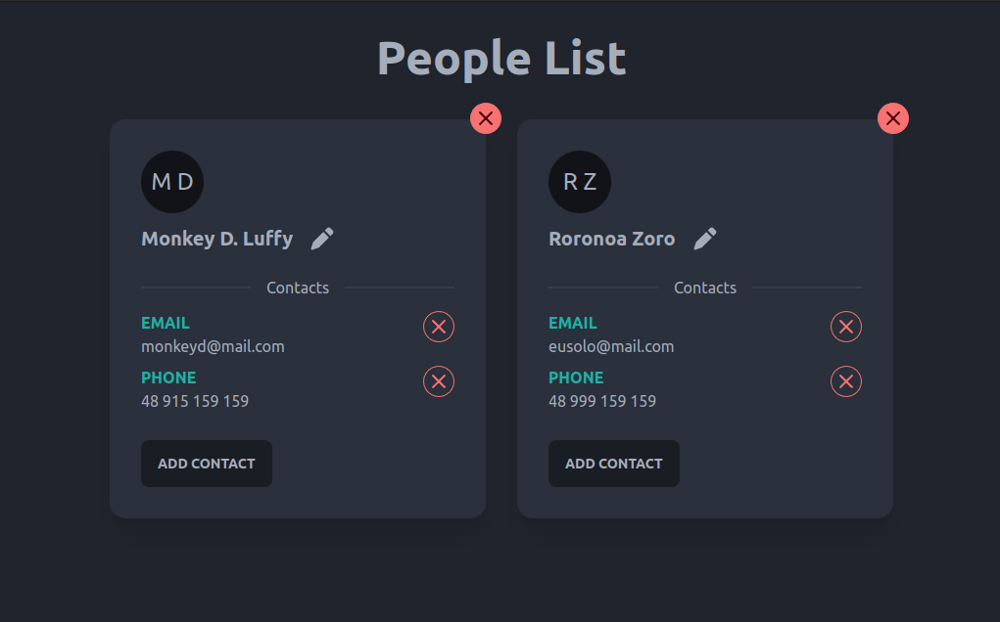

# 📲 Contact List App

## Description

Never miss a contact again. This app helps to store your contacts.

## Techs

### Backend

* Node
* Express
* TypeORM

### Database
* PostegreSQL

### Frontend
* Angular
* TailwindCSS
* DaisyUI

## Getting Started

### Install the dependencies

On the main directory run: 

```bash
    $ npm run setup
```

### Run with Docker

On the main directory just run (Docker needed):

```bash
  $ docker compose up
```

#### Default ports

* frontend - 4200
* backend - 8000
* postgres - 5432

### Run without docker

Check the readme inside each project.

## Pages
### Home



### People list

